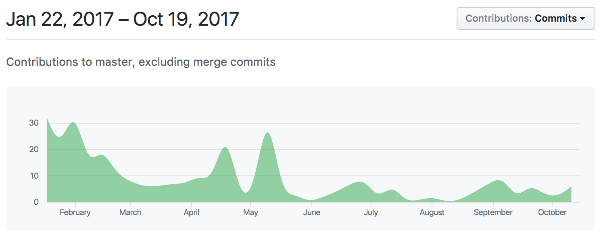

# React Navigation POC

## Requirements:
 - ✅ **navigator push**
 - ✅ **navigator pop**
 - 👎🏼 **navigator replace**
 - 👎🏼 **navigator pop to top**
 - 👎🏼 **navigator pop number of routes**
 - 👎🏼 **configurable navigation transitions per screen** _(https://github.com/react-community/react-navigation/issues/2585)_
 - ✅ **select a different tab**
 - ✅ **custom styles for different platform headers**
 - ✅ **custom header components**
 - ✅ **update route params**
 - ✅ **conduct navigation actions through non-screen level components**

## Bonus points:
 - ✅ **hide tabbar for individual screen**
 - 😩 **standard and extendable deep link handling** _It exists, but it cannot be used with redux (https://github.com/react-community/react-navigation/issues/1106)_
 - ✅ **integrate with redux**
 - [ ] **translucent navigation bar**

## Results:

### Pros:
 - Dead-simple deeplinking support
 - Navigate using `withNavigation` from non-screen components
 - Seems pretty consistently active

### Cons:
 - No `replace()`, `popToTop()`, or `popN()` _(Show-stopper?)_
 - Transitions don't seem as smooth as `react-native-navigation`
 - Passing props into a component happens through `this.props.navigation.state.params` 👎🏼
